# Cyberster Red Team Internship - Week 1 Report

## Intern Details
- Name: Syed Muhammad Rayyan
- Roll No: CSI-BI-620
- Program: Cyberster Internship
- Track: Red Team (Training Environment)
- Week: 1
- Target: `vulnweb.com`
- Classification: Training / Authorized Reconnaissance

## Objective (from tutorial)
Master passive information gathering and identify the target's digital footprint without active exploitation.

## Executive Summary
This report follows the tutorial workflow across 4 tasks:
1. Passive OSINT and subdomain enumeration.
2. Infrastructure and technology profiling.
3. Google/GitHub dorking for exposure checks.
4. Live asset filtering and visual recon.

### Key Numbers
- `subfinder.txt`: **19**
- `assetfinder.txt`: **7**
- `amass.txt`: **40**
- `clean_subdomains.txt`: **27** unique
- `attack_surface.txt`: **27**
- `live-urls.txt`: **7** live hosts

## Task 01 - Passive OSINT & Subdomain Enumeration
**Learning Goal (tutorial):** No single tool is enough; cross-referencing passive data is essential.

### Step 1 - Create Working Directory `{1}`
```bash
mkdir week-1
cd week-1
```
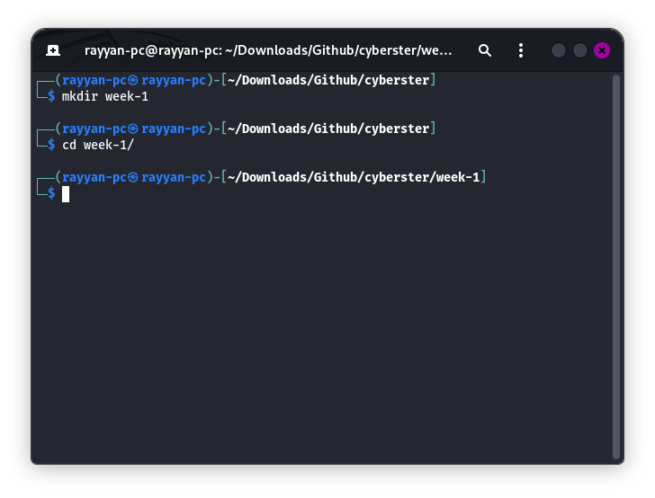

### Step 2 - Run Subfinder `{2}`
```bash
subfinder -d vulnweb.com -o subfinder.txt
```
From tutorial context: Subfinder is clean, fast passive discovery and can also run in `-silent` mode for file-friendly output.
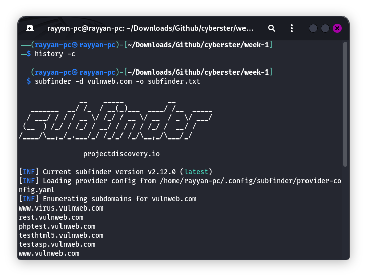

### Step 3 - Run Assetfinder + Amass Passive `{3}`
```bash
assetfinder --subs-only vulnweb.com > assetfinder.txt
amass enum -passive -d vulnweb.com -o amass.txt
```
From tutorial context:
- `assetfinder --subs-only` avoids unrelated domains.
- `amass` tends to run longer due to broad OSINT correlation and recursive expansion.
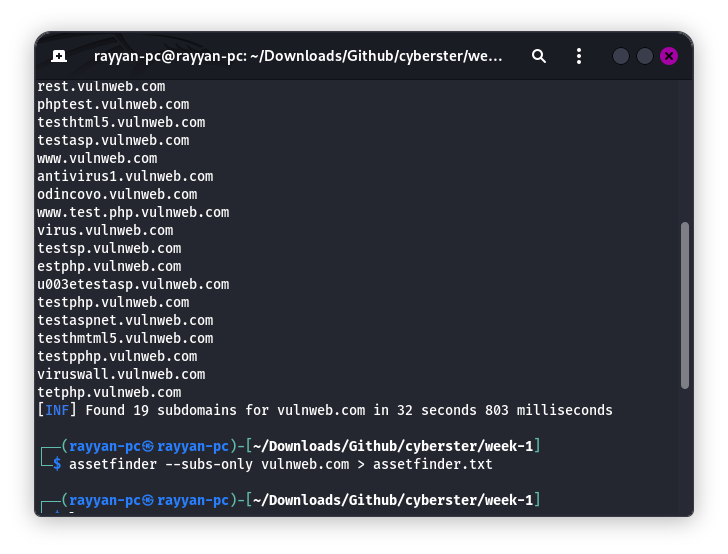

### Step 4 - Merge, Normalize, and Deduplicate `{4}`
```bash
cat subfinder.txt assetfinder.txt amass.txt \
  | tr '[:upper:]' '[:lower:]' \
  | grep -Eo '([a-z0-9-]+\.)*vulnweb\.com' \
  | sort -u > clean_subdomains.txt
```
Why it matters: clean attack-surface list before validation.
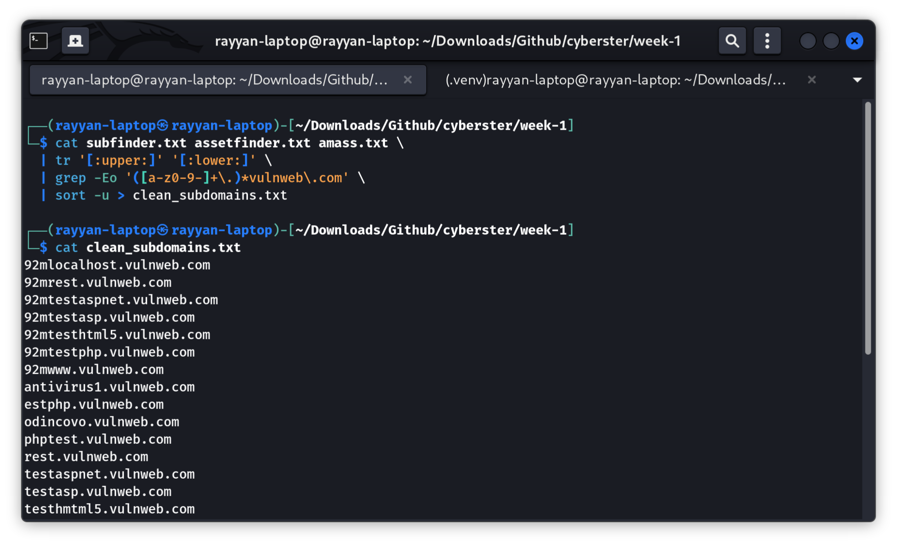

### Step 5 - Count Unique Assets `{5}`
```bash
wc -l clean_subdomains.txt
```
Result: **27 unique subdomains**.
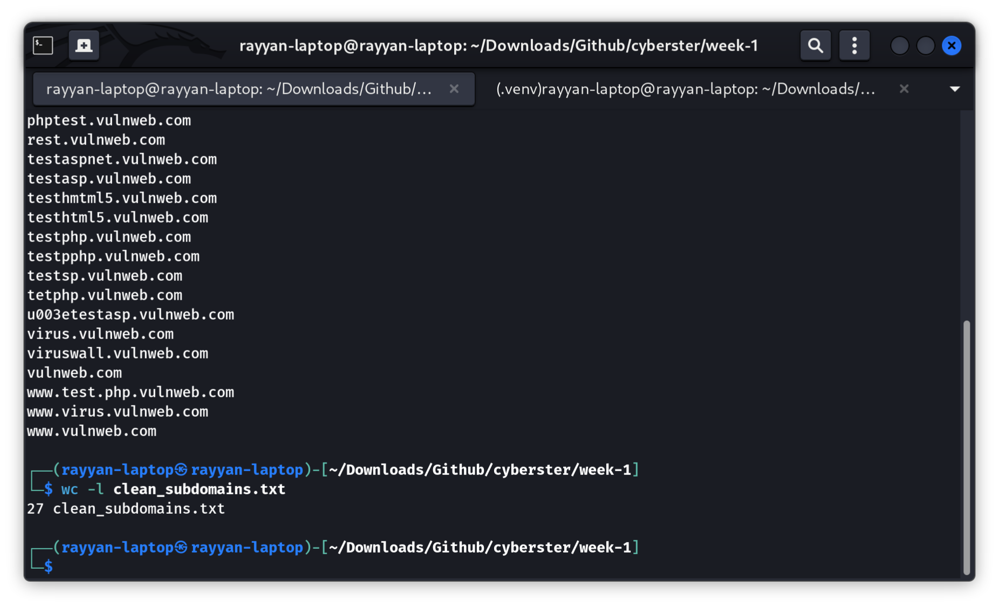

### Step 6 - Overlap Confidence Check `{6}`
```bash
sort subfinder.txt assetfinder.txt amass.txt | uniq -c | sort -nr | head
```
Tutorial principle: repeated entries across sources are generally higher confidence.
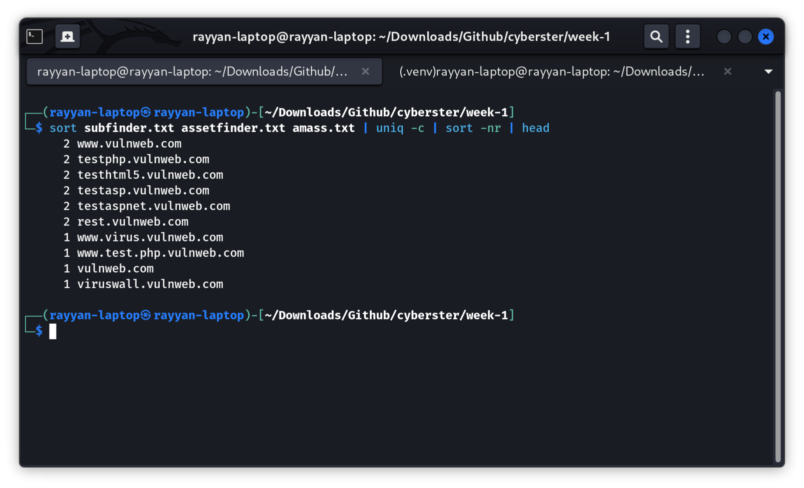

### Step 7 - crt.sh Collection Setup `{7}`
```bash
git clone https://github.com/az7rb/crt.sh.git
```
Tutorial context: Certificate Transparency often reveals historical/staging/forgotten assets.
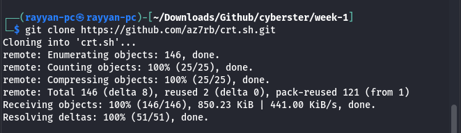

### Step 8 - DNSDumpster Source `{8}`
Use DNSDumpster to collect additional DNS-based OSINT.
- `https://dnsdumpster.com/`
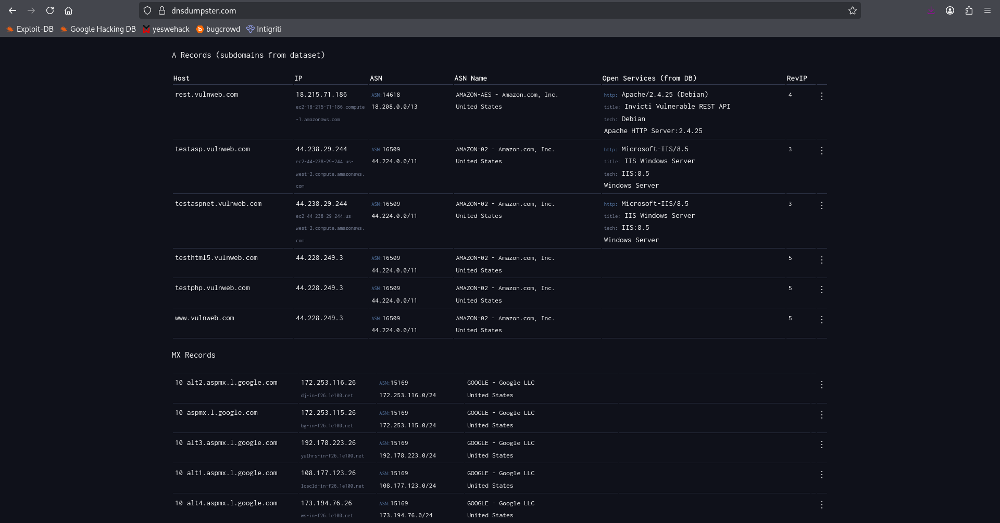

### Step 9 - Install XLSX Converter `{9}`
```bash
sudo apt install xlsx2csv
```
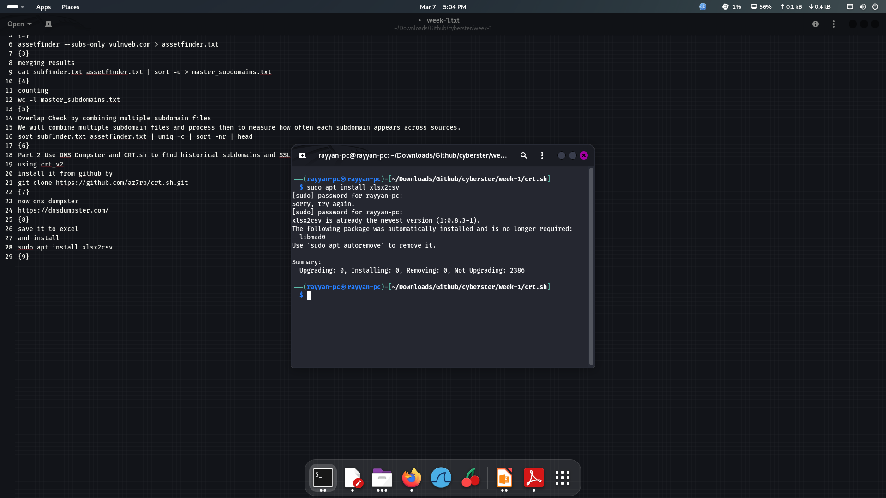

### Step 10 - Convert Export and Extract Domains `{10}`
```bash
xlsx2csv -a vulnweb.xlsx > vulnweb.csv
grep -oE "[a-zA-Z0-9.-]+\.vulnweb\.com" vulnweb.csv | sort -u > vulnweb.txt
rm vulnweb.xlsx vulnweb.csv
```
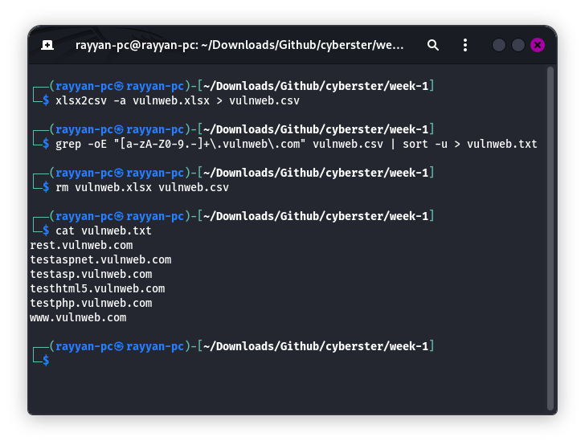

### Step 11 - Build Expanded Attack Surface `{11}`
```bash
cat clean_subdomains.txt vulnweb.txt | sort -u > attack_surface.txt
```
Tutorial framing: this is the expanded, merged recon dataset.
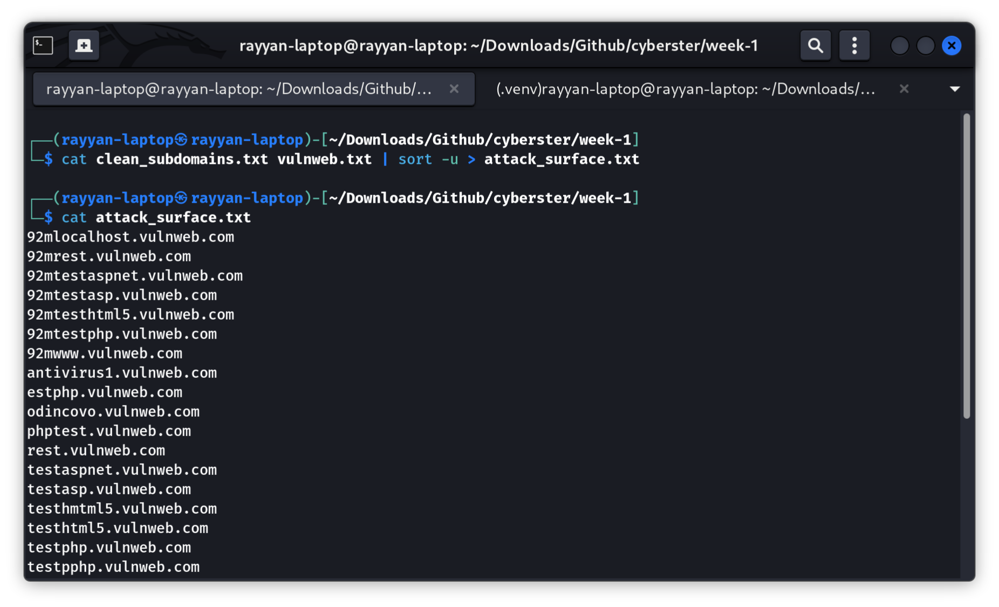

## Task 02 - Infrastructure & Tech Profiling
**Learning Goal (tutorial):** Convert host list into technology and ownership intelligence.

### Step 12 - WhatWeb Fingerprinting `{12}`
```bash
whatweb http://vulnweb.com
```
Purpose from tutorial: detect server/CMS/framework/CDN clues and narrow likely attack paths.
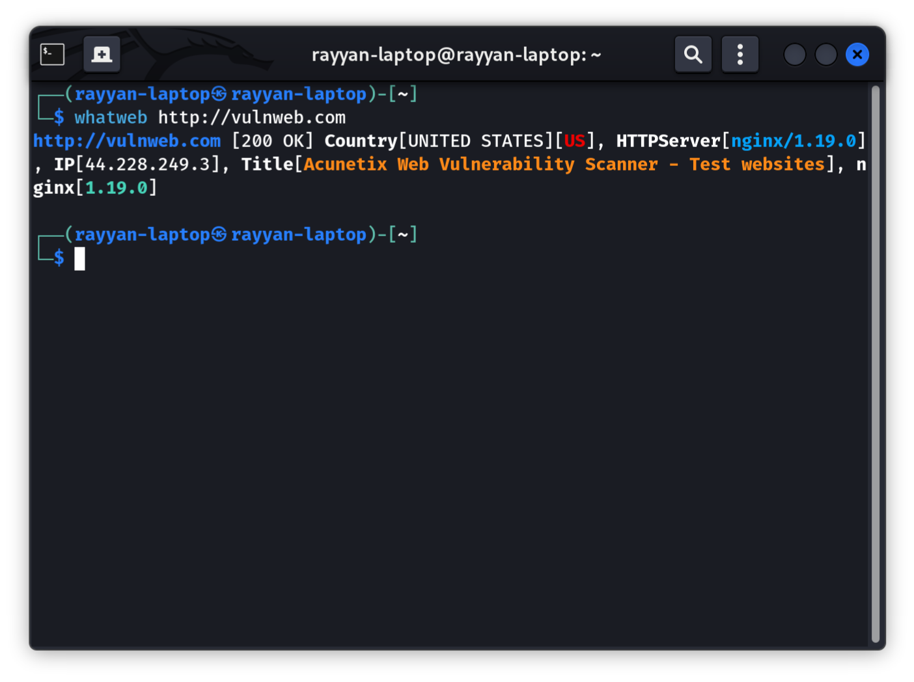

### Step 13 - Wappalyzer Cross-Check `{13}`
Supplement WhatWeb using browser-based technology fingerprinting.
Observed stack clues included server/framework/frontend signals.
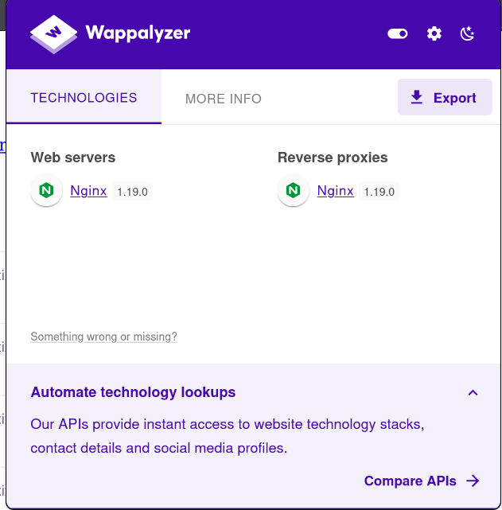

### Step 14 - WHOIS Query `{14}`
```bash
whois vulnweb.com
```
Focus fields (tutorial): Registrar, Organization, Name Servers, NetRange/CIDR clues, abuse contact.
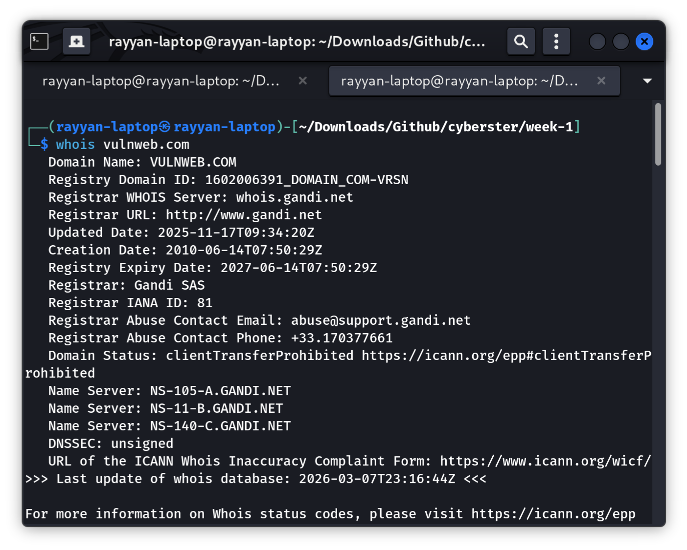

### Step 15 - WHOIS Key Findings (summarized) `{15}`
- Registrar: **Gandi SAS** (IANA `81`)
- Registrant org: **Invicti Security Limited**
- Created: **2010-06-14**, Updated: **2025-11-17**, Expiry: **2027-06-14**
- NS: `NS-105-A.GANDI.NET`, `NS-11-B.GANDI.NET`, `NS-140-C.GANDI.NET`
- Abuse: `abuse@support.gandi.net`, `+33.170377661`
- DNSSEC: unsigned

Note: full NetRange/CIDR typically needs IP WHOIS/RDAP on resolved addresses.
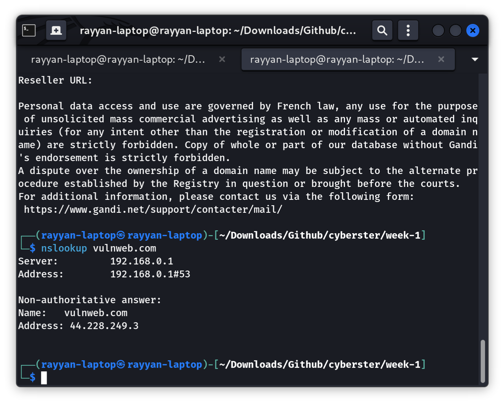

### Step 16 - NSLookup Baseline `{16}`
```bash
nslookup vulnweb.com
```
Used to map DNS/IP relationship and hosting pattern.
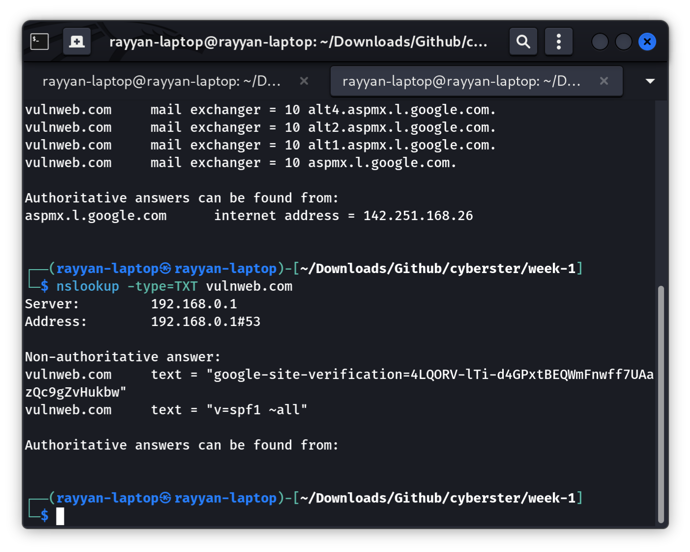

### Step 17 - DNS Record-Specific Queries `{17}`
```bash
nslookup -type=A vulnweb.com
nslookup -type=MX vulnweb.com
nslookup -type=TXT vulnweb.com
```
Tutorial alternative: `dig` for deeper DNS mapping.
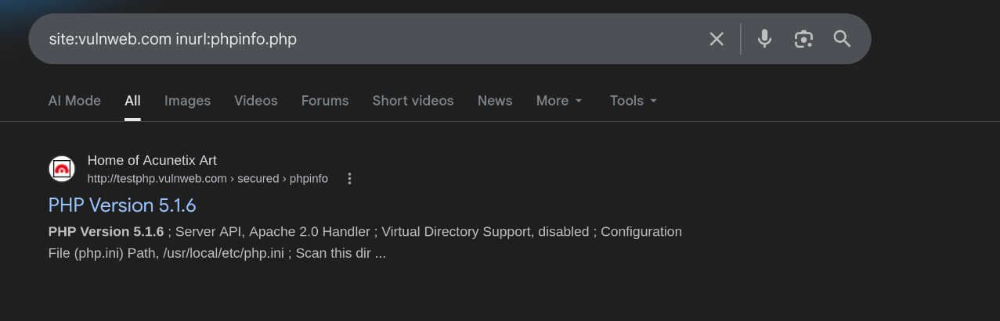

## Task 02 Part 2 - Google Dorking
**Learning Goal (tutorial):** Find passive exposure indicators like debug files, backups, and indexing leaks.

### Step 18 - `phpinfo()` Dork and Sensitive Exposure Check `{18}`
```text
site:vulnweb.com inurl:phpinfo.php
```
Observed implication: information disclosure via publicly accessible environment/config detail.
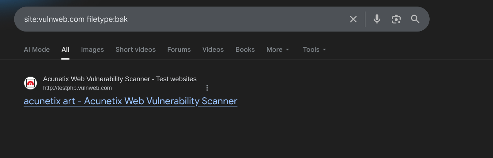

### Step 19 - `.env`, `robots.txt`, and Backup Dorks `{19}`
Queries attempted:
- `site:vulnweb.com filetype:env`
- `site:vulnweb.com inurl:.env`
- `site:vulnweb.com inurl:robots.txt`
- `site:vulnweb.com filetype:bak`

Outcome: no major `.env`/`robots.txt` exposure in tested results; backup-related references observed.
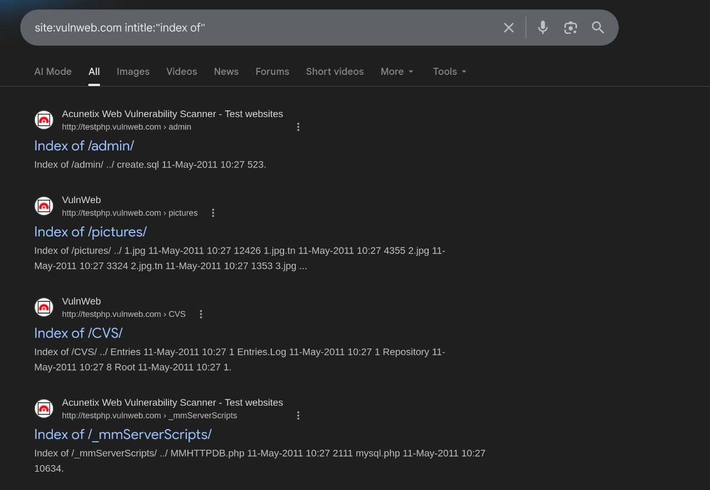

### Step 20 - Directory Listing Discovery `{20}`
```text
site:vulnweb.com intitle:"index of"
```
Why it matters (tutorial): directory listings may leak uploads, logs, backups, or internal docs.
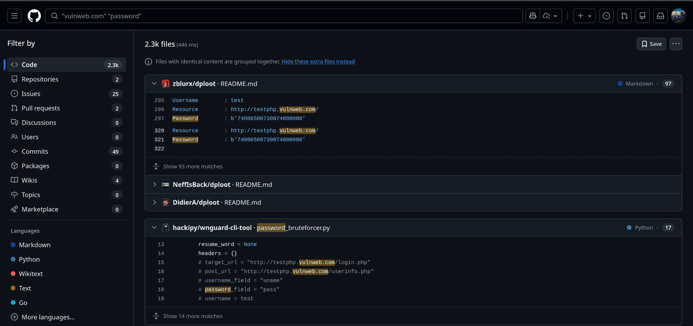

## Task 03 - GitHub Dorking & Credential Leak Review
**Learning Goal (tutorial):** identify hardcoded secrets and verify if they are real, active, and risky.

### Step 21 - Manual GitHub Dorking `{21}`
Queries:
- `"vulnweb.com" "api_key"`
- `"vulnweb.com" "password"`
- `"vulnweb.com" "aws_secret"`
- `"vulnweb.com" "AWS_SECRET_ACCESS_KEY"`

Checklist from tutorial:
- hardcoded vs test/demo
- active code vs docs/comments
- commit history persistence risk
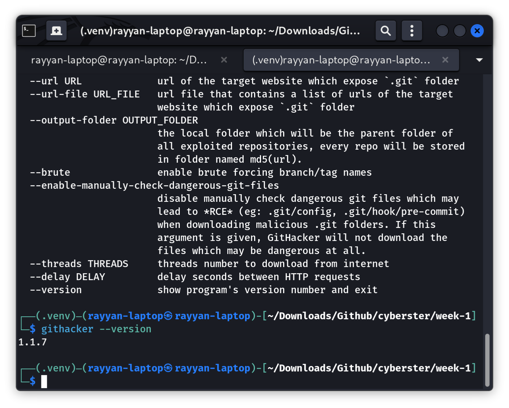

### Step 22 - GitHacker Validation `{22}`
```bash
githacker --url http://vulnweb.com/.git/ --output-folder githacker
```
Observed result: target is not an exposed valid git repo (`.git/HEAD` missing).
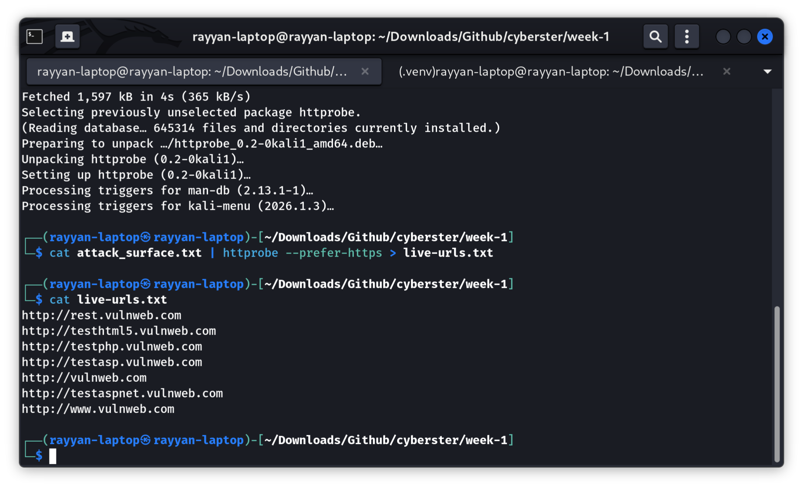

## Task 04 - Live Asset Filtering & Visual Recon
**Learning Goal (tutorial):** reduce noise and prioritize active high-value targets only.

### Step 23 - Live Host Validation + Visual Recon Output `{23}`
```bash
cat attack_surface.txt | httprobe --prefer-https > live-urls.txt
cat attack_surface.txt | httpx -status-code -title -tech-detect -o live-httpx.txt
cat live-urls.txt | aquatone -out ~/aquatone_results
```
Result: **7 live URLs** identified from **27** merged subdomains.
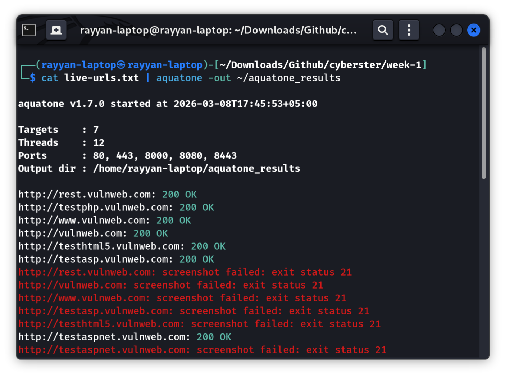

## Final Findings Snapshot
- Passive enumeration + cross-validation produced a broader, cleaner attack-surface map.
- Historical sources (CT + DNS export) expanded coverage beyond single-tool results.
- Profiling identified mixed technologies (`nginx`, `IIS`, `Apache`, frontend libraries, cloud indicators).
- Dorking identified passive exposure signals and verified process for leak hunting.
- Live filtering reduced effort to reachable, practical assets.

## Ethics Statement
All work was performed as authorized training reconnaissance. No exploitation actions were executed.
