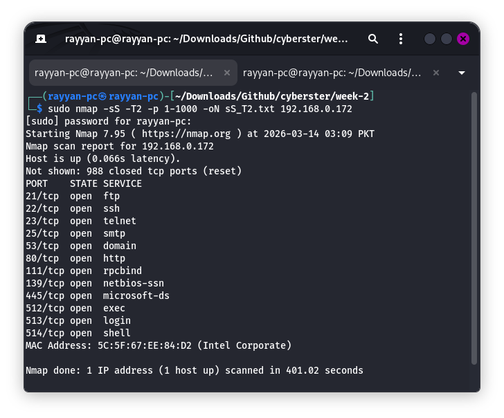
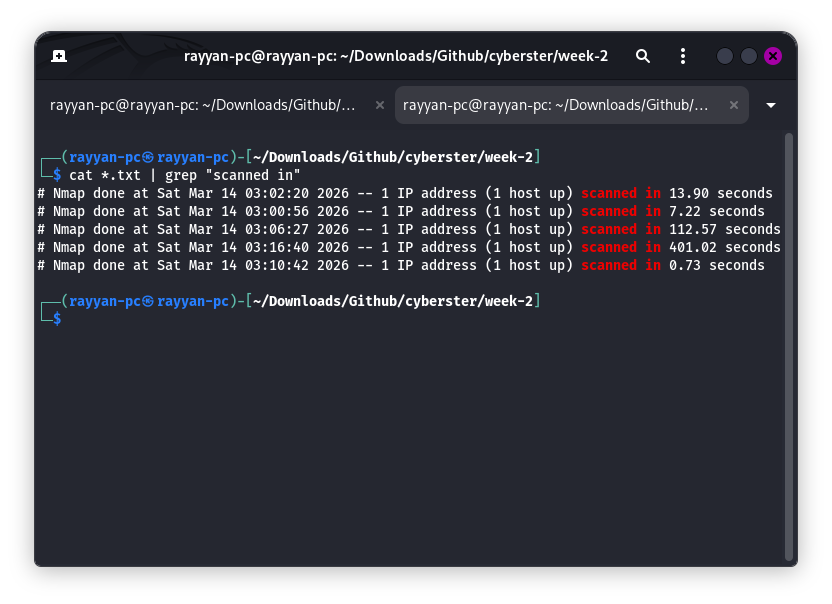

# CYBERSTER RED TEAMING
## Network Enumeration & Service Vulnerability Discovery - Week 02

| Detail | Information |
| :--- | :--- |
| **Name** | Syed Muhammad Rayyan |
| **Roll No** | CSI-BI-620 |
| **Internship Program** | Cyberster Internship |
| **Task Title** | Network Enumeration & Service Vulnerability Discovery |
| **Target Machine** | Metasploitable 2 (192.168.0.172) |
| **Engagement Type** | Active Reconnaissance & Vulnerability Scanning |

---

### Task 01: Advanced Network Scanning with Nmap
**Objective:** Transition from broad reconnaissance to targeted network scanning, identifying open ports and fingerprinting services while avoiding basic security triggers.

#### 1.1 Host Discovery & Initial Setup
The first step in any engagement is identifying the target's presence on the network. We start by checking our own network configuration and then performing a ping sweep on the local subnet to locate the Metasploitable 2 VM.

```bash
ifconfig
```

*Step 1: Identifying local network interface and gateway configuration.*

```bash
nmap -sn 192.168.0.205/24
```

*Step 2: Subnet discovery scan to identify the target IP address (192.168.0.172).*

#### 1.2 Comparative Analysis of Scan Techniques
We executed three distinct scan types to analyze their impact on speed and visibility.

**TCP Connect Scan (-sT):** Completes the full 3-way handshake. Reliable but leaves a larger footprint in application logs.
```bash
nmap -sT -p 1-1000 -oN results_sT.txt 192.168.0.172
```

*Step 3: Execution of the full TCP 3-way handshake scan.*

**SYN Stealth Scan (-sS):** Sends a SYN packet and waits for a SYN-ACK, then immediately sends a RST. This avoids completing the connection.
```bash
sudo nmap -sS -p 1-1000 -oN results_sS.txt 192.168.0.172
```

*Step 4: Execution of the stealthy half-open SYN scan.*

**UDP Scan (-sU):** Probes stateless ports. Due to the lack of a handshake, this scan is significantly slower as it must wait for timeouts.
```bash
sudo nmap -sU --top-ports 100 -oN results_udp.txt 192.168.0.172
```

*Step 5: Execution of the UDP scan for stateless services.*

#### 1.3 Timing Templates Performance
Nmap timing templates control the speed and aggressiveness of the probes.

**Polite Template (-T2):** Used for maximum stealth to avoid triggering IDS/IPS rate limits.
```bash
sudo nmap -sS -T2 -p 1-1000 -oN sS_T2.txt 192.168.0.172
```

*Step 6: Polite scan execution (T2) for IDS evasion.*

**Aggressive Template (-T4):** Optimized for speed on stable, fast networks.
```bash
sudo nmap -sS -T4 -p 1-1000 -oN sS_T4.txt 192.168.0.172
```

*Step 7: Aggressive scan (T4) for rapid enumeration.*

**Comparative Summary:**
The following table summarizes the time taken for each scanning methodology.

| Scan Type | Command Flag | Scan Duration |
| :--- | :--- | :--- |
| **TCP Connect** | -sT | 7.22s |
| **SYN Stealth** | -sS | 13.90s |
| **UDP Scan** | -sU | 12.57s |
| **Aggressive** | -T4 | 0.73s |
| **Polite** | -T2 | 401.02s |


*Step 8: Consolidated view of scan timings and efficiency.*

---

### Task 02: Service Fingerprinting & Attack Surface Mapping
**Objective:** Identify exact software versions to map against known vulnerabilities and exploit databases.

#### 2.1 Version Detection & Aggressive Scanning
Using version detection (-sV) probes open ports to extract service headers and determine the exact software version. The aggressive scan (-A) combines this with OS fingerprinting and default script execution.

```bash
nmap -sV 192.168.0.172 -oN results_sV.txt
```

*Step 9: Identifying specific versions like vsFTPd 2.3.4 and Apache 2.2.8.*

```bash
nmap -A 192.168.0.172 -oN results_A.txt
```

*Step 10: OS detection and script scanning results confirming Linux environment.*

#### 2.2 Manual Banner Grabbing
Manual verification is essential to confirm automated results. We use Netcat to manually connect and retrieve service banners.

```bash
nc 192.168.0.172 80
HEAD / HTTP/1.0
```

*Step 11: Manually extracting the Apache web server banner via Netcat.*

#### 2.3 SMB Enumeration
Ports 139 and 445 (Samba) often reveal critical information about the target's internal structure.

```bash
enum4linux -a 192.168.0.172
```

*Step 12: Successful unauthenticated SMB session revealing user accounts and shares.*

---

### Task 03: Leveraging Nmap Scripting Engine (NSE)
**Objective:** Automate vulnerability detection using the built-in Nmap Scripting Engine categories.

#### 3.1 HTTP Enumeration & Path Discovery
NSE scripts can automate directory brute-forcing to find hidden configuration files or admin panels.

```bash
sudo nmap -p 80 --script http-enum 192.168.0.172
```

*Step 13: Finding sensitive paths such as /phpinfo.php and /phpMyAdmin/.*

#### 3.2 Network Discovery Scripts
The 'discovery' category probes for a wide range of network information, including DNS, SNMP, and SMB details.

```bash
sudo nmap --script discovery 192.168.0.172
```

*Step 14: Broad discovery scripts revealing network-level configurations.*

#### 3.3 Vulnerability Identification
The 'vuln' category checks for specific, known exploits based on the identified service versions.

```bash
sudo nmap --script vuln 192.168.0.172
```

*Step 15: Critical vulnerability detection results mapping to specific CVE IDs.*

**Service Vulnerability Mapping:**

| Port | Service | Vulnerability | CVE ID | Risk Level |
| :--- | :--- | :--- | :--- | :--- |
| **21** | FTP | vsFTPd 2.3.4 Backdoor | CVE-2011-2523 | Critical |
| **25** | SMTP | SSL POODLE | CVE-2014-3566 | Medium |
| **80** | HTTP | Slowloris DoS | CVE-2007-6750 | High |
| **5432** | PostgreSQL | CCS Injection | CVE-2014-0224 | Medium |
| **6667** | IRC | UnrealIRCd Trojan | CVE-2010-2075 | Critical |
| **1524** | Shell | Bindshell Root Access | N/A | Critical |

---

### Task 04: Stealth & Firewall Evasion Techniques
**Objective:** Employ packet manipulation and traffic masking to bypass basic network security filters.

#### 4.1 MTU Manipulation
Changing the Maximum Transmission Unit (MTU) forces the network stack to fragment packets in non-standard sizes, which can evade simple signature-based packet inspection.

```bash
sudo nmap -sS --mtu 16 192.168.0.172
```

*Step 16: Scanning with a specific MTU of 16 to bypass size-based packet filters.*

#### 4.2 Source Port Spoofing
Firewalls often allow traffic from "trusted" ports. We can disguise our scan as standard DNS traffic by originating it from Port 53.

```bash
sudo nmap -sS --source-port 53 192.168.0.172
```

*Step 17: Disguising scan traffic as DNS queries to bypass port-specific filters.*

---

### Actionable Insights & Conclusion
The most critical "Initial Access" point identified is the **vsFTPd 2.3.4 Backdoor (CVE-2011-2523)** on Port 21. This vulnerability allows for immediate, unauthenticated root access. Combined with the **Unauthenticated Bindshell on Port 1524**, the target machine is highly susceptible to full compromise.

**Recommendations:**
1.  **Immediate Remediation:** Disable or update the vsFTPd service and remove the unauthenticated bindshell on Port 1524.
2.  **Service Hardening:** Update Apache (Port 80) and PostgreSQL (Port 5432) to mitigate the Slowloris and CCS injection vulnerabilities.
3.  **Network Security:** Implement strict firewall ingress/egress rules to prevent unauthenticated access to database and administrative services.

---
**Date:** March 14, 2026
**Classification:** Training / Authorized Engagement
