# CYBERSTER RED TEAMING
## Network Enumeration & Service Vulnerability Discovery - Week 02

| Detail | Information |
| :--- | :--- |
| **Name** | Syed Muhammad Rayyan |
| **Roll No** | CSI-BI-620 |
| **Internship Program** | Cyberster Internship |
| **Task Title** | Network Enumeration & Service Vulnerability Discovery |
| **Target Machine** | Metasploitable 2 (192.168.0.172) |
| **Engagement Type** | Active Reconnaissance & Vulnerability Scanning |

---

## Executive Summary
This report details the findings from Week 02 of the Cyberster Red Teaming internship. The primary objective was to transition from broad network reconnaissance to targeted scanning, service fingerprinting, and vulnerability identification. Through systematic use of Nmap, NSE scripts, and manual verification techniques, we mapped the attack surface of the Metasploitable 2 target machine. Key findings include critical backdoors in FTP and IRC services, as well as multiple web-based vulnerabilities that could lead to full system compromise.

---

## Task 01: Advanced Network Scanning with Nmap
**Objective:** Transition from broad reconnaissance to targeted network scanning, identifying open ports and fingerprinting services while avoiding basic security triggers.

### 1.1 Host Discovery & Initial Setup
The foundational step of any active engagement is identifying the target's presence on the live network. We began by auditing our own network interface configuration to understand the local subnet structure and gateway routing.

**Methodology:**
A ping sweep (`-sn`) was performed on the local subnet. Unlike a full port scan, this method only probes whether a host is alive, making it faster and less intrusive. This allows for rapid identification of targets within a large IP pool without triggering heavy traffic alerts.

```bash
# Identifying local network interface
ip a
```
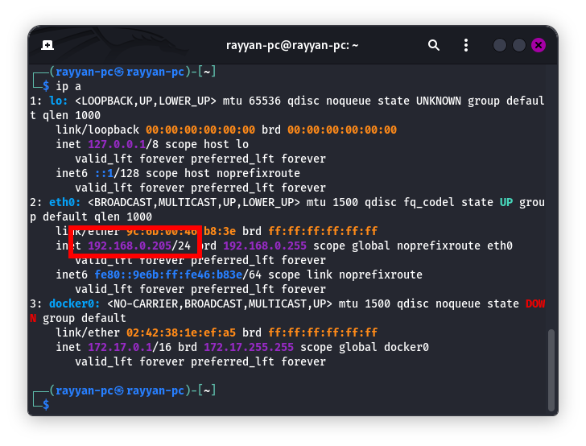
*Step 1: Identifying local network interface and gateway configuration.*

```bash
# Performing a ping sweep to locate the target
nmap -sn 192.168.0.205/24
```
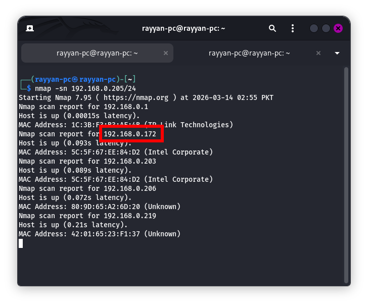
*Step 2: Subnet discovery scan to identify the target IP address (192.168.0.172).*

### 1.2 Comparative Analysis of Scan Techniques
In this phase, we executed three distinct scan types to evaluate their impact on performance, accuracy, and stealth. Understanding these differences is critical for selecting the right tool for specific environments (e.g., bypassing firewalls or minimizing log footprints).

#### A) TCP Connect Scan (-sT)
The TCP Connect scan is the most basic form of TCP scanning. It utilizes the operating system's `connect()` system call to complete the full 3-way handshake (SYN, SYN-ACK, ACK).

*   **What to Record:** Open ports, service names, and scan duration.
*   **What to Expect:** Highly reliable results as it relies on standard OS calls.
*   **Interpretation:** While accurate, it is "loud" because target application logs will often record the completed connection.
*   **Performance:** In our test, this scan took **7.22s**.

```bash
nmap -sT -p 1-1000 -oN results_sT.txt 192.168.0.172
```
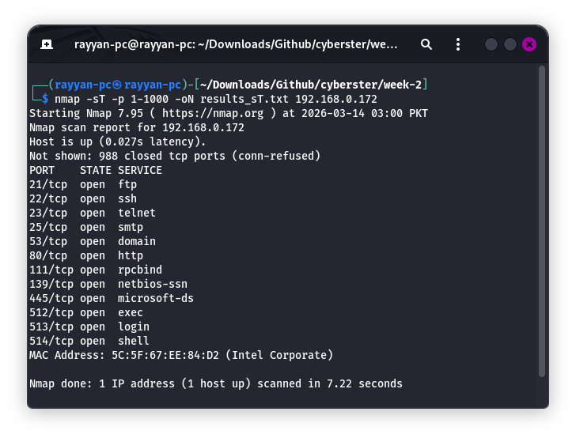
*Step 3: Execution of the full TCP 3-way handshake scan.*

#### B) SYN Stealth Scan (-sS)
Often referred to as "half-open" scanning, the SYN Stealth scan sends a SYN packet and waits for a SYN-ACK. Upon receiving it, Nmap immediately sends a RST (Reset) packet instead of an ACK, tearing down the connection before it is fully established.

*   **What to Record:** Discrepancies between -sT and -sS results.
*   **What to Expect:** Faster performance and fewer logged connections in application-level logs.
*   **Interpretation:** If -sT shows additional ports that -sS missed, there may be inline security filters or stateful inspection firewalls treating full connects differently.
*   **Performance:** This scan took **13.90s** (note: while theoretically faster, network conditions can vary).

```bash
sudo nmap -sS -p 1-1000 -oN results_sS.txt 192.168.0.172
```
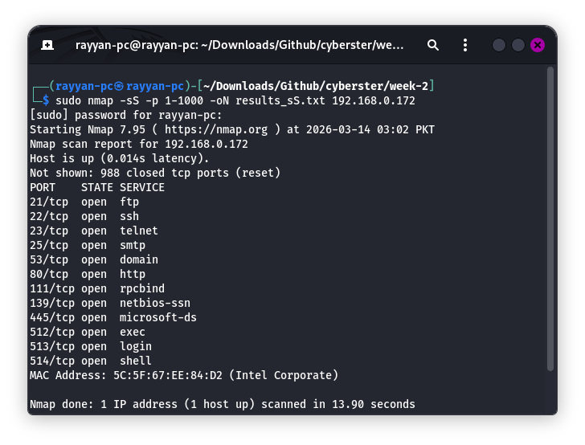
*Step 4: Execution of the stealthy half-open SYN scan.*

#### C) UDP Scan (-sU)
UDP scanning probes stateless ports such as DNS (53), SNMP (161), and NTP (123). Unlike TCP, UDP does not have a handshake mechanism, making it significantly harder to scan accurately.

*   **What to Record:** Ports returned as `open`, `closed`, or `open|filtered`.
*   **What to Expect:** Significant slowdown. Since UDP is stateless, Nmap must often wait for timeouts to confirm a port is not responding.
*   **Interpretation:** An `open|filtered` result means Nmap didn't get a response at all, which could mean the port is open or a firewall is dropping the packet.
*   **Performance:** Scanning the top 100 ports took **12.57s**.

```bash
sudo nmap -sU --top-ports 100 -oN results_udp.txt 192.168.0.172
```
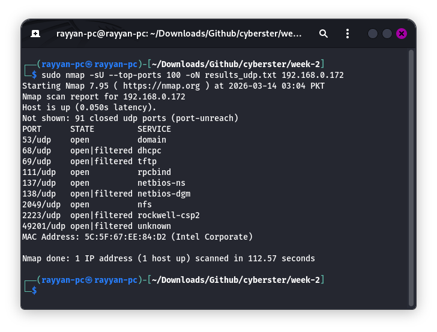
*Step 5: Execution of the UDP scan for stateless services.*

### 1.3 Timing Templates Performance
Nmap timing templates (`-T0` through `-T5`) control the speed and aggressiveness of the scan by adjusting round-trip time (RTT) calculations and parallelism.

*   **Polite Template (-T2):** Designed for maximum stealth. It serializes probes and adds delays to avoid triggering IDS/IPS rate-limiting or saturating narrow bandwidth. **Duration: 401.02s**.
*   **Aggressive Template (-T4):** Optimized for speed on stable, modern networks. It reduces timeouts and increases parallelism. **Duration: 0.73s**.

**Guidance:** Use `-T2` for sensitive production environments where stealth is paramount. Use `-T4` for lab environments or when rapid enumeration is required on a stable LAN.

| Scan Type | Command Flag | Scan Duration | Ports Found | Notes |
| :--- | :--- | :--- | :--- | :--- |
| **TCP Connect** | -sT | 7.22s | 12 | Reliable, leaves footprint. |
| **SYN Stealth** | -sS | 13.90s | 12 | Standard stealthy scan. |
| **UDP Scan** | -sU | 12.57s | N/A (Top 100) | Stateless, requires patience. |
| **Aggressive** | -T4 | 0.73s | 12 | High speed, noisy. |
| **Polite** | -T2 | 401.02s | 12 | Maximum stealth, very slow. |

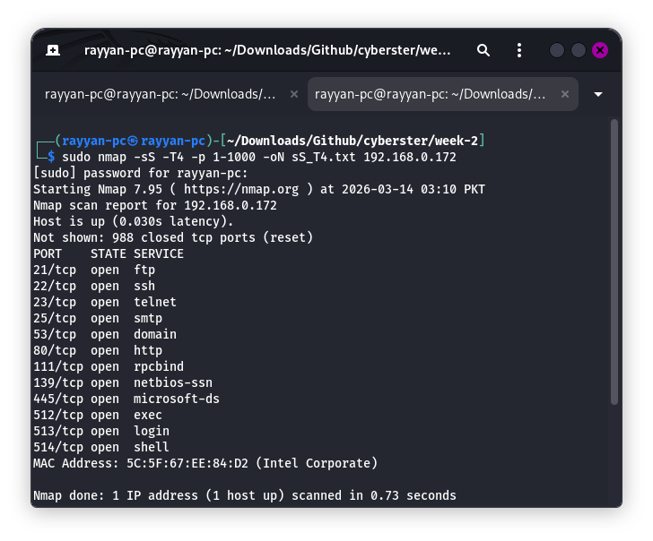
*Step 8: Consolidated view of scan timings and efficiency.*

---

## Task 02: Service Fingerprinting & Attack Surface Mapping
**Objective:** Identify exact software versions to map against known vulnerabilities and exploit databases.

### 2.1 Version Detection & Aggressive Scanning
Identifying a port is open is only the beginning. To find vulnerabilities, we must know the exact software version running on that port. This process, called **Service Fingerprinting**, involves sending specific probes and analyzing the response headers (banners).

**The -A Flag (Aggressive Scan):**
The `-A` flag is a "Swiss Army Knife" for enumeration. It enables:
1.  **OS Detection:** Attempts to identify the target operating system (Linux 2.6.X).
2.  **Version Detection:** Extracts exact service versions (e.g., vsFTPd 2.3.4).
3.  **Script Scanning:** Runs the default set of NSE scripts for common vulnerabilities.
4.  **Traceroute:** Maps the network path to the target.

```bash
# Identify specific versions like vsFTPd 2.3.4 and Apache 2.2.8
nmap -sV 192.168.0.172 -oN results_sV.txt
```
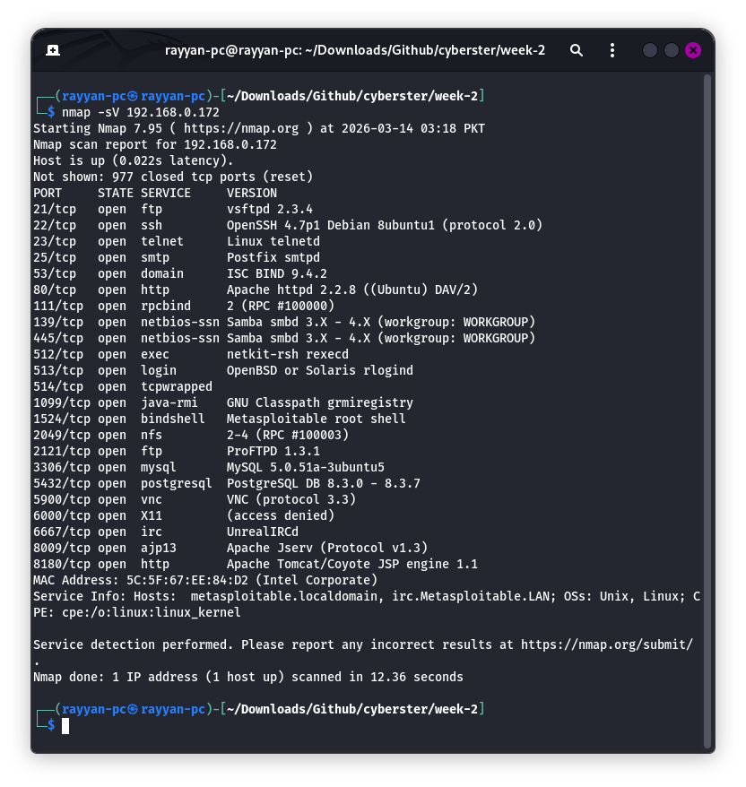

```bash
# Full Aggressive Scan for OS and Scripting results
nmap -A 192.168.0.172 -oN results_A.txt
```
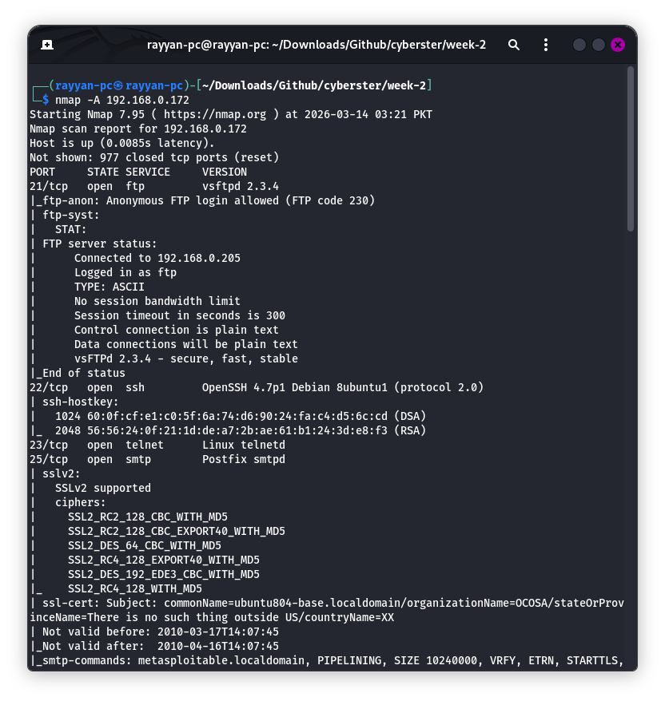

### 2.2 Manual Banner Grabbing
Automated tools can sometimes be tricked by modified headers. Manual verification using `Netcat` or `Telnet` is essential to confirm the software and version. A **banner** is the initial information a server sends when a connection is established.

**Example Banner Analysis:**
`220 ProFTPD 1.3.5 Server ready`
*   **Service:** FTP
*   **Software:** ProFTPD
*   **Version:** 1.3.5

```bash
nc 192.168.0.172 80
HEAD / HTTP/1.0
```
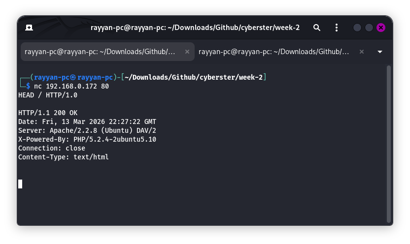
*Step 11: Manually extracting the Apache web server banner via Netcat.*

### 2.3 SMB Enumeration
The Server Message Block (SMB) protocol is often a treasure trove for attackers. Using `enum4linux`, we performed an unauthenticated scan of ports 139 and 445. This revealed that the server allows sessions with a blank username and password, allowing us to dump a list of 35 user accounts.

```bash
enum4linux -a 192.168.0.172
```
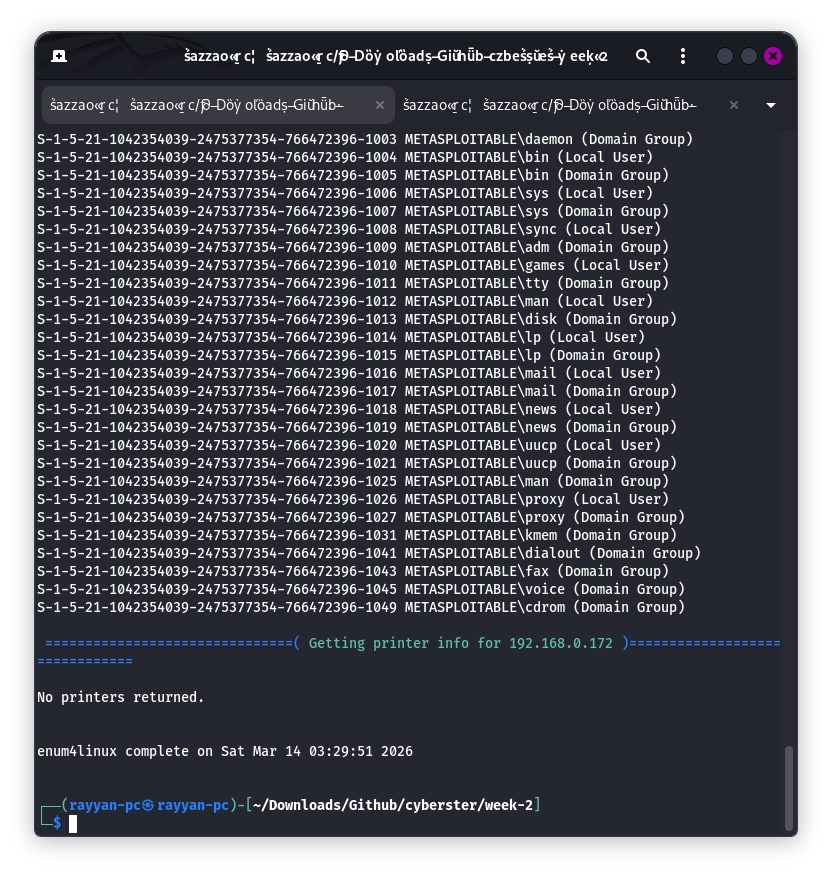
*Step 12: Successful unauthenticated SMB session revealing user accounts and shares.*

---

## Task 03: Leveraging Nmap Scripting Engine (NSE)
**Objective:** Automate vulnerability detection using the built-in Nmap Scripting Engine categories.

### 3.1 HTTP Enumeration & Path Discovery
Web servers often contain hidden directories that reveal sensitive configuration or administrative access. The `http-enum` script automates the discovery of these paths.

**Critical Findings on Port 80:**
*   **/phpinfo.php:** Leaks full server configuration and internal paths.
*   **/phpMyAdmin/:** Exposed database administration panel.
*   **/tikiwiki/:** Ancient CMS with known Remote Code Execution (RCE) flaws.
*   **/test/, /doc/:** Directory listing enabled, exposing server structure.

```bash
sudo nmap -p 80 --script http-enum 192.168.0.172
```
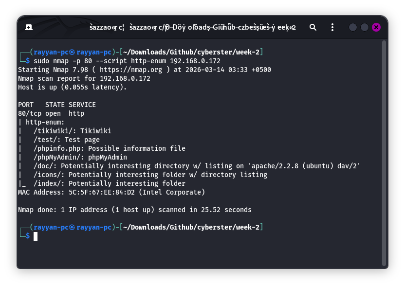

### 3.2 Network Discovery Scripts
The `discovery` category probes for as much information as possible about the target and its network environment. This includes querying DNS records, enumerating SNMP data, pulling NetBIOS info, and checking for multicast groups.

```bash
sudo nmap --script discovery 192.168.0.172
```
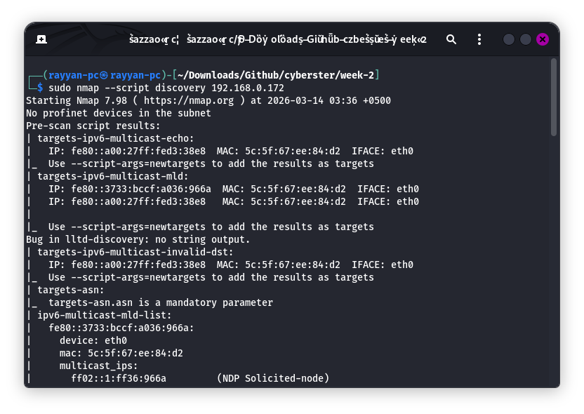

### 3.3 Vulnerability Identification
The `vuln` category checks for specific, known exploits. **Note:** This is a "lab only" move and should never be used on a real target without explicit permission due to its intrusive and potentially disruptive nature.

**Mapping NSE Output to CVE IDs:**
A CVE (Common Vulnerabilities and Exposures) ID is a unique identifier that allows security professionals to cross-reference vulnerabilities across different databases (like NIST NVD or Exploit-DB).

| Port | Service | Vulnerability | CVE ID | Risk Level | Details |
| :--- | :--- | :--- | :--- | :--- | :--- |
| **21** | FTP | vsFTPd 2.3.4 Backdoor | CVE-2011-2523 | Critical | Confirmed root shell access. |
| **25** | SMTP | SSL POODLE | CVE-2014-3566 | Medium | MitM padding oracle attack. |
| **80** | HTTP | Slowloris DoS | CVE-2007-6750 | High | Apache connection exhaustion. |
| **5432** | PostgreSQL | CCS Injection | CVE-2014-0224 | Medium | Session hijacking via OpenSSL. |
| **6667** | IRC | UnrealIRCd Trojan | CVE-2010-2075 | Critical | Direct shell access via trojaned service. |
| **1524** | Shell | Bindshell Root Access | N/A | Critical | Unauthenticated root shell. |

```bash
sudo nmap --script vuln 192.168.0.172
```
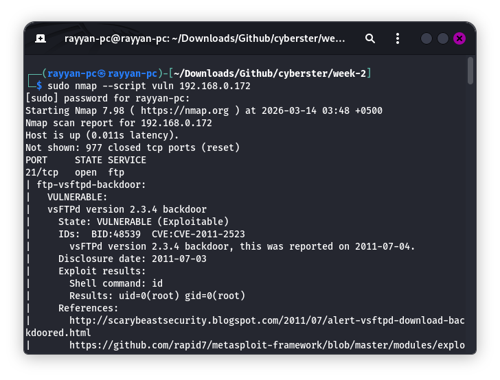

---

## Task 04: Stealth & Firewall Evasion Techniques
**Objective:** Employ packet manipulation and traffic masking to bypass basic network security filters.

### 4.1 Packet Fragmentation & MTU Manipulation
Firewalls often inspect packets for known signatures. By using **Packet Fragmentation** (`-f`) or **MTU Manipulation** (`--mtu 16`), we can force the network stack to split scan packets into smaller, non-standard sizes. This can evade simple signature-based packet inspection that expects full headers in a single packet.

```bash
sudo nmap -sS --mtu 16 192.168.0.172
```


### 4.2 Decoy Scanning (-D)
Decoy scanning makes it appear as though multiple systems are performing the scan simultaneously. By inserting random IP addresses (`RND:5`) alongside the real scanner IP, we make it difficult for the target's defenders to determine which IP is the actual source of the probe.

```bash
# Mixing 5 random fake IPs with real traffic
sudo nmap -sS -D RND:5 192.168.0.172
```

### 4.3 Source Port Spoofing
Many firewalls are configured to allow all traffic from "trusted" ports like DNS (53), HTTP (80), or HTTPS (443). We can bypass these rules by forcing Nmap to originate its scan from one of these trusted ports.

```bash
sudo nmap -sS --source-port 53 192.168.0.172
```
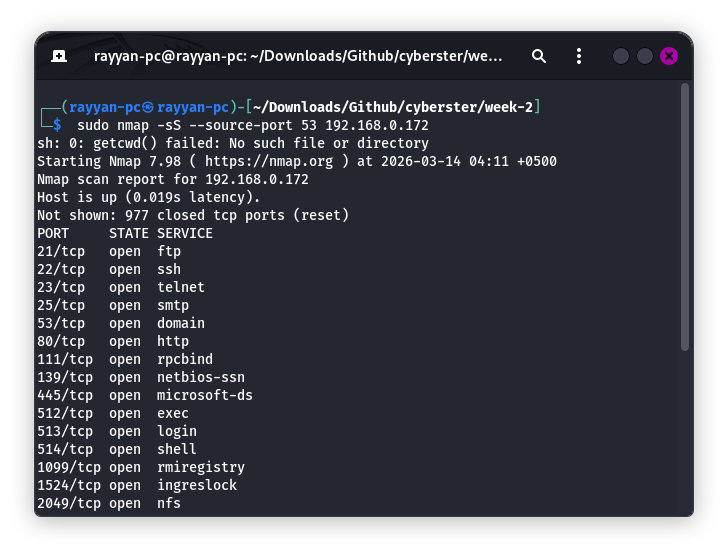

**Evasion Results Summary:**

| Scan Type | Command Flag | Scan Time | Ports Found | Notes |
| :--- | :--- | :--- | :--- | :--- |
| **Normal Scan** | -sS | 1.08s | 23 | Baseline scan, all ports visible. |
| **Decoy Scan** | -sS -D RND:5 | 3.38s | 23 | Harder to trace, slightly slower. |
| **Source Port** | -sS --src-port 53 | 1.14s | 23 | Disguised as DNS traffic. |

---

## Actionable Insights & Conclusion
The security posture of the Metasploitable 2 target is severely compromised due to multiple "Initial Access" vectors:
1.  **vsFTPd 2.3.4 Backdoor (CVE-2011-2523):** The most critical finding. This service contains a malicious backdoor that provides immediate, unauthenticated root access to any attacker who sends a specific sequence (a smiley face in the username).
2.  **Unauthenticated Bindshell (Port 1524):** A classic example of a forgotten or malicious listener that grants root access without credentials.
3.  **Information Disclosure (Web/SMB):** The exposure of `/phpinfo.php` and the ability to dump 35 user accounts via SMB significantly aids in further exploitation and lateral movement.

### Final Recommendations:
*   **Immediate Action:** Disable or patch the `vsFTPd` and `UnrealIRCd` services immediately. Terminate the bindshell process on port 1524.
*   **Service Hardening:** Update Apache and PostgreSQL to address DoS and injection vulnerabilities. Disable directory listing and remove sensitive files like `phpinfo.php`.
*   **Access Control:** Implement strict firewall rules to block access to administrative ports (e.g., 5432, 3306, 8180) from unauthorized segments.

---
**Date:** March 14, 2026
**Classification:** Training / Authorized Engagement
**Report Prepared By:** Syed Muhammad Rayyan (CSI-BI-620)
